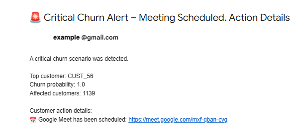
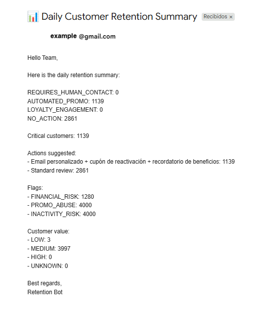
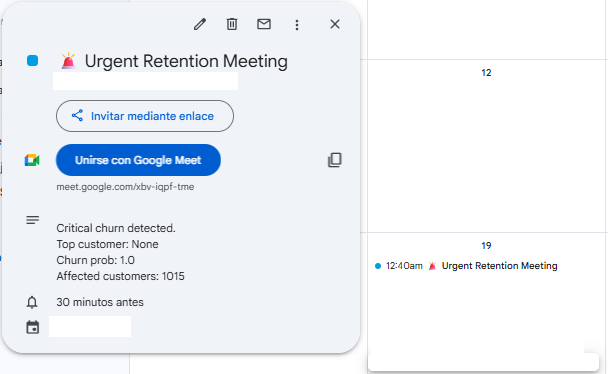
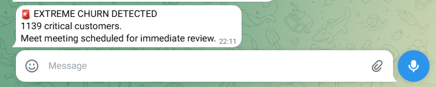
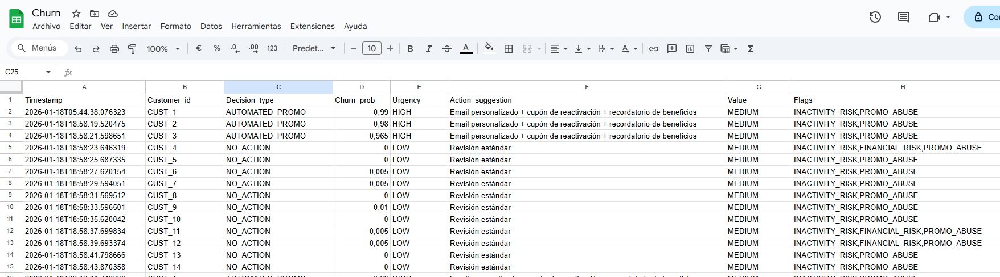

# 🚀 Auto Retention Agents  

## Multi-Agent Churn Response System (FastAPI, Batch, Real Integrations, GitHub Actions)

A Python-based multi-agent system designed to analyze churn risk at scale (4k customers) and orchestrate business-aware retention decisions, combining:

* Batch processing from CSV (model outputs)
* Manager-level summaries & insights
* Selective real-world actions (Email, Calendar, Telegram)
* FastAPI for interactive demos 
* Production-oriented design (dry-run, feature flags, schedulers)
* Fully automated execution via GitHub Actions

This project is intentionally manager-first: instead of spamming thousands of customers, it focuses on decision transparency, aggregation, and operational realism.

---

## 🧠 What does this system do?

Given a CSV containing customer data + churn probability (produced by an ML model), the system:

1. Processes thousands of customers in batch
2. Classifies churn risk into business decisions
3. Generates a manager summary (counts, categories, examples)
4. Logs results to Google Sheets (audit & reporting)
5. Sends a single manager email with insights
6. Optionally triggers real actions for a small sample of customers
7. Exposes a FastAPI layer for demos and testing
8. Runs automatically on GitHub Actions(scheduled or on-demand)

---

## 🏗️ Architecture Overview

```bash

                      ┌────────────────────┐
                      │ CSV Churn Data     │
                      │ (4.000 users)      │
                      └─────────┬──────────┘
                                │
                                ▼
                      ┌────────────────────┐
                      │ Feature Loader /   │
                      │ Data Preprocessing │
                      └─────────┬──────────┘
                                │
                                ▼
                      ┌────────────────────┐
                      │ Decision Agent     │
                      │ decide_action()    │
                      │ batch_decisions()  │
                      └─────────┬──────────┘
                                │                 
                                │
                                ▼
                      ┌────────────────────┐
                      │ manager_summary    │
                      │ (aggregated counts)│
                      └─────────┬──────────┘
                                │
                                ▼
                      ┌────────────────────┐
                      │ Action Agent       │
                      │ (Orchestrator)     │
                      └─────────┬──────────┘
                                │
       ┌─────────────┬──────────┼─────────────┐
       ▼             ▼          ▼             ▼
 ┌──────────┐ ┌──────────┐ ┌──────────┐  ┌────────────────────┐
 │ Email    │ │ Calendar │ │ Telegram │  │ Sheets Audit Log   │          
 │ Summary  │ │ Strategy │ │ Alerts   │  │ (per customer)     │
 └──────────┘ └──────────┘ └──────────┘  └────────────────────┘
                                ▲
                                │
                ┌──────────────────────────────┐
                │ FastAPI (Demo Layer)         │
                │ single‑customer simulation   │
                └──────────────────────────────┘
          
```
**⚡ Automation:** `main.py` runs fully via GitHub Actions, triggering batch processing, manager reporting, and all action channels automatically.

```bash
auto-retention-agents/
│ 
├─ github/
│  └─ workflows                       # GitHub Actions workflows
│       └─ run-main.yml               # Executes main.py automatically on schedule or push 
│ 
├─ agents/
│  ├─ decision_agent.py               # Contains business rules and decision logic
│  ├─ action_agent.py                 # Orchestrates all action channels
│  ├─ aggregation_agent.py            # Summarizes and aggregates decisions
│  ├─ google_agents.py                # Gmail, Calendar, Sheets helpers
│  └─ telegram_agent.py               # Telegram bot integration
│
├─ utils/                             # Utility and helper functions
│  ├─ flags_utils.py                  # Feature flags and execution switches
│  ├─ generate_churn_csv.py           # Churn data model generator
│  └─ __init__.py
│
├─ data/                              # Input datasets
│  ├─ customers_with_churn_prob.csv   # Customers with churn probability scores
│  └─ rf_v1_baseline_train.csv        # Training dataset for churn model
│
├─ models/                            # Trained ML models
│  └─ churn_model.joblib              # Random Forest churn prediction model
│ 
├─ images/                            # Agent illustrations and visuals
│ 
├─ config/                            # Config examples (without credentials)
│  └─ credentials_example.json
│
├─ scripts/                           # Manual and one-off execution scripts
│  └─ generate_refresh_token.py       # One-time Google OAuth token generator
│
├─ tests/                          
│  ├─ agents/                         # Agent unit tests
│  │  ├─ test_google_agents.py        # Google services integration tests
│  │  └─  test_telegram_agent.py       # Telegram bot tests
│  │
│  ├─ api/                            # FastAPI tests
│  │  └─ test_api.py
│  │
│  └─ batch/                          # Batch execution tests
│     └─ test_batch_agents.py
│ 
├─ README.md                          # Project documentation
├─ main.py                            # Entry point for batch execution
├─ app.py                             # FastAPI demo layer
└─ requirements.txt                   # Dependencies
```
---

## 📊 Dataset

- Real supermarket customer dataset  
- Demographic + transactional variables  
- **Churn probability already computed** by an external ML model
- The system **does not train models**, it consumes model outputs

---

## 🤖 Decision Logic 

Decisions are **deterministic** and **explainable**, based on churn probability after the .joblib model:

| Churn Probability | Decision Type | Meaning |
|-------------------|----------------------------|--------|
| ≥ 0.70 | REQUIRES_HUMAN_CONTACT | High risk – escalation |
| 0.50 – 0.69 | AUTOMATED_PROMO | Automated retention |
| 0.30 – 0.49 | LOYALTY_ENGAGEMENT | Soft engagement |
| < 0.30 | NO_ACTION | No intervention |

This makes the system:

- Predictable
- Auditable
- Manager‑friendly
- Suitable for real operations

### Customer Retention Decision Matrix 

| Churn Risk      | Value | Flags                     | Suggested Action                                    | Urgency  |
|-----------------|-------|---------------------------|---------------------------------------------------|----------|
| High (>0.7)     | High  | INACTIVITY_RISK           | Urgent call + exclusive benefit + dedicated AM   | CRITICAL |
| High (>0.6)     | High  | FINANCIAL_RISK            | Meeting with account manager + personalized plan | CRITICAL |
| High (>0.6)     | High  | PROMO_ABUSE               | Retention call + upgrade to premium loyalty      | HIGH     |
| High (>0.6)     | Medium| INACTIVITY_RISK           | Personalized email + reactivation coupon        | HIGH     |
| High (>0.6)     | Medium| FINANCIAL_RISK            | Automated email + financing / installment       | HIGH     |
| High (>0.6)     | Medium| PROMO_ABUSE               | Points program email + non-monetary benefits    | MEDIUM   |
| High (>0.6)     | Low   | INACTIVITY_RISK           | Automated reactivation email + moderate discount | MEDIUM   |
| High (>0.5)     | Low   | FINANCIAL_RISK            | Email with budget products + referral program   | MEDIUM   |
| High (>0.6)     | Low   | PROMO_ABUSE               | Product education email + one-time discount     | MEDIUM   |
| Low (<0.3)      | High  | None                      | Automatic VIP program + early access + events   | LOW      |
| Medium (0.3-0.5)| High  | Any                       | Proactive check-in + surprise + feedback        | LOW      |
| Special Cases   | Custom| PROMO_ABUSE / FINANCIAL_RISK / other | Personalized actions based on profile        | LOW-MEDIUM-HIGH |

🔴 CRITICAL

🟠 HIGH

🟡 MEDIUM

🟢 LOW

---

## 👥 Manager Actions 

- Aggregated churn distribution
- Counts per decision category
- Example customers per category
- Google Sheet row
- Single email summary
- Optional calendar sync (review meetings)
- Automated daily execution via GitHub Actions (`main.py` runs on schedule)

---

## ⚙️ Action Agent (Core Orchestrator)

All executions go through:

```python
action_agent(decision)
```

Responsibilities:

- Channel selection (email / calendar / telegram / audit)
- Feature flags (real vs dry-run)
- OAuth handling & refresh
- Failure isolation
- Audit logging
- Supports scheduled triggers: local batch runs or GitHub Actions workflow

### Example High‑Risk Flow

For `REQUIRES_HUMAN_CONTACT`:

- 📧 Email notification
- 📅 Calendar meeting (+ Meet link)
- 📊 Google Sheets audit

---

## 📌 Action Channels

The Action Agent executes each customer action through a single orchestrator (`action_agent()`), triggering the appropriate channel depending on churn risk:

**Email**  
Sends personalized or summary emails to managers.  

  
  

**Calendar**  
Schedules meetings and generates Google Meet links for high-risk customers.  

  

**Telegram**  
Sends critical alerts or engagement messages via the Telegram bot.  

  

**Audit Sheet**  
Logs actions and manager summaries in Google Sheets for auditing and reporting.  



---

## 🧪 Testing Strategy

✅ Action-Based Tests

* Email only
* Email + Meet + Calendar
* Sheet Audit logs
* Telegram message
* No action

✅ API Tests (Demo Layer)

FastAPI endpoints used for **simulation and demos**:

- `GET /`  healthcheck
- `GET /customers/sample`  sample input
- `POST /run-batch`  limited batch execution

✅ Batch Execution Tests

Validate batch behavior with CSV inputs:

- Multiple customers (4k scale)
- Deterministic churn-based decisions (non-random)
- Real integrations enabled (email, sheets, calendar)
- GitHub Actions automated execution tested successfully

✅ Scheduler Simulation

- Manual execution 
- Prepared for GitHub Actions

✅ Controlled Error & Failure Tests

Explicit testing of failure scenarios:

- Expired OAuth tokens
- Missing Google Sheet
- Telegram API failures
- Disabled services via feature flags

---

## 🌐 FastAPI (Demo Layer)

FastAPI exists to **simulate behavior**, not to process massive batches.

Endpoints:

- `GET /` – healthcheck
- `GET /customers/sample` – demo input
- `POST /run-customer/{id}` – single‑customer simulation
- `POST /run-batch?limit=10` – small batch demo

> ⚠️ Real production runs use **batch scripts + schedulers**, not API triggers.

---

## 🧱 Tech Stack

- Python 3.12
- Pandas
- FastAPI
- Google APIs (Gmail, Calendar, Sheets, Meet)
- Telegram Bot API
- OAuth 2.0
- python-dotenv
- GitHub Actions (batch automation)

---
## 🚧 Next Steps

- 🧠 Replace rules with ML explainability layer
- ☁️ Cloud deployment (GCP / AWS / Azure)
- 📊 Manager dashboard (BI / Looker / Streamlit)

---

## 🎯 Why this project?

This is **a real business project**. It demonstrates:

- Multi‑agent orchestration
- Batch‑first, manager‑aware design
- Real API integrations
- Production constraints (scale, cost, safety)
- Clear separation of decision vs execution
- Automation using Github actions

It mirrors **how retention systems actually work in companies**.
---

## ▶️ How to Use

### 1. Clone the repository

```bash
git clone https://github.com/BarbaraAngelesOrtiz/auto-retention-agents.git
cd auto-retention-agents 
```

### 2. Create and activate a virtual environment

```bash
python -m venv venv

# Windows
venv\Scripts\activate

# macOS / Linux
source venv/bin/activate
```

### 3. Install dependencies

```bash
pip install -r requirements.txt
```

### 4. Environment variables

Create a .env file:

```bash

# Google APIs
GOOGLE_CREDENTIALS_FILE=config/google_credentials.json
GMAIL_CLIENT_ID=your_client_id
GMAIL_CLIENT_SECRET=your_client_secret
GMAIL_REFRESH_TOKEN=your_refresh_token

# Gmail
GMAIL_SENDER=your_email@gmail.com
GMAIL_RECIPIENT=your_email@gmail.com

# Google Sheets
SPREADSHEET_ID=your_sheet_id

# Telegram
TELEGRAM_BOT_TOKEN=your_bot_token
TELEGRAM_CHAT_ID=your_chat_id

# Others
DRY_RUN=true

# ===========================
# Notes for GitHub Actions
# ===========================
# When creating a GitHub Actions workflow trigger (e.g., push, schedule), 
# it's safer to store secrets as GitHub Actions environment variables 
# rather than committing the .env file.
#
# 1. Go to your repository -> Settings -> Secrets and variables -> Actions -> New repository secret
# 2. Add each secret (e.g., GOOGLE_CREDENTIALS_JSON, TELEGRAM_BOT_TOKEN, etc.)
# 3️. In your workflow YAML, reference them like this:
#
# env:
#   GOOGLE_CREDENTIALS_JSON: ${{ secrets.GOOGLE_CREDENTIALS_JSON }}
#   TELEGRAM_BOT_TOKEN: ${{ secrets.TELEGRAM_BOT_TOKEN }}
#
# This way, sensitive credentials are never committed to GitHub and are safely injected 
# when the workflow runs.

```

### 5. Run the FastAPI server

```bash
uvicorn main:app --reload
```
Open Swagger UI:
```bash
http://127.0.0.1:8000/docs
```

### 6. Run a batch simulation (local)

Runs a batch of customers with simulated churn scores and real actions:
```bash
python test_batch_random.py
```

### 7. Test API batch execution
```bash
POST /run-batch?limit=5

Example response:
```bash
{
  "processed": 5,
  "results": [
    {
      "customer_id": "C1000",
      "churn_score": 0.87,
      "action": "schedule_meeting_with_meet",
      "status": "success"
    }
  ]
}
```

### 8. Test individual actions

You can test specific flows:

* Google APIs: Email + Calendar + Meet + Sheet
* Telegram message

### 9. Simulate daily execution

```bash
python main.py
```

Supports:

- `dry_run=True`
- Limited customer actions
- Full manager reporting

Use the batch script to simulate a daily run:

```bash
python test_batch_agents.py
```

This mimics a scheduler-triggered execution (cron / Airflow).

### 🔒 Notes

* Google OAuth tokens may expire (handled by refresh logic)
* Failures are logged and do not crash the pipeline
* All actions are executed through a single entry point

---

## Author

**Bárbara Ángeles Ortiz**


[LinkedIn](https://www.linkedin.com/in/barbaraangelesortiz/) | 

 📅 January 2026


